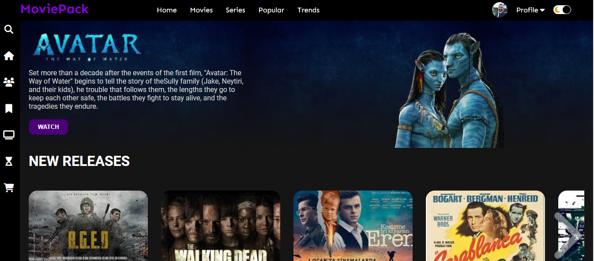
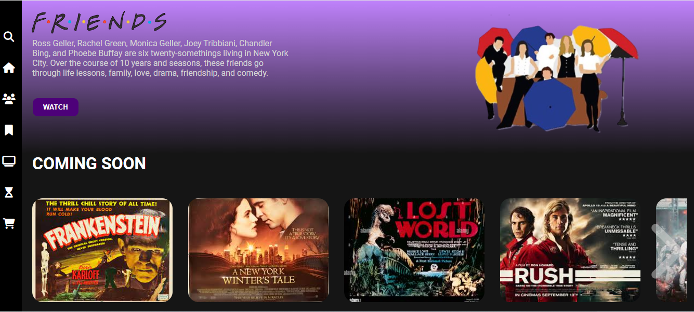
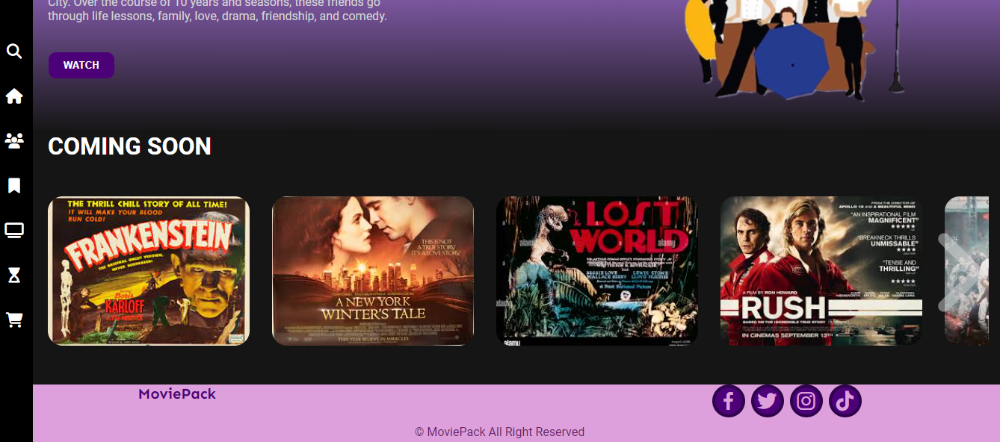

# MoviePack

A web application showcasing movies and series.

## Table of Contents

- [Introduction](#introduction)
- [Features](#features)
- [Usage](#usage)
- [Installation](#installation)
- [Screenshots](#screenshots)
- [Contributing](#contributing)
- [License](#license)

## Introduction

Describe your project here.

## Features

- List the features of your project.

## Usage

Provide instructions on how to use the application.

## Installation

Describe how to install or set up the project.

## Screenshots

## Contributing to MoviePack

We welcome contributions to MoviePack! If you're interested in improving this project, here's how you can contribute:

### Reporting Issues

- If you encounter any bugs or have suggestions for improvements, please [open an issue](link_to_repository/issues) on GitHub. Provide as much detail as possible to help us understand the problem.

### Feature Requests

- If you have ideas for new features or enhancements, feel free to [open an issue](link_to_repository/issues) and describe your suggestion. We appreciate detailed explanations and any additional context you can provide.

### Pull Requests

- Fork the repository.
- Create a new branch (`git checkout -b feature/awesome-feature`).
- Make your changes and commit them (`git commit -am 'Add awesome feature'`).
- Push the changes to your branch (`git push origin feature/awesome-feature`).
- [Create a Pull Request](link_to_repository/compare) detailing your changes and mentioning the related issue numbers.

### Code Guidelines

- Please follow the existing code style and guidelines.
- Ensure any new code is well-documented.
- Write descriptive commit messages to maintain clarity and conciseness.

### Review Process

- All submitted pull requests will be reviewed by project maintainers.
- Feedback or additional changes may be requested before merging.

